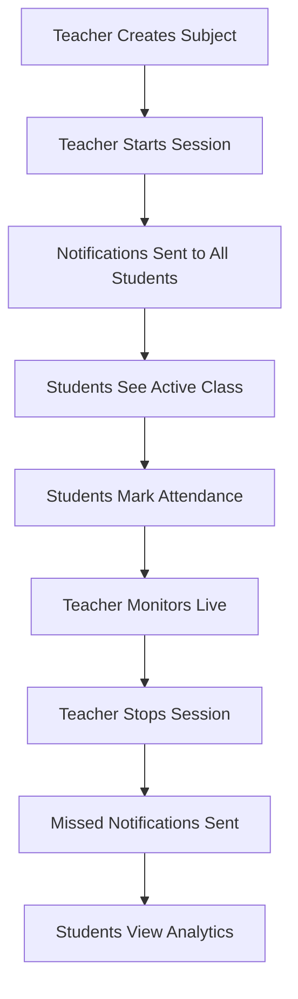

# 📱 MERN Stack Attendance System

<div align="center">

### *A modern, real-time attendance management solution for educational institutions*

[](https://reactnative.dev/)
[](https://expo.dev/)
[](https://nodejs.org/)
[](https://expressjs.com/)
[](https://www.mongodb.com/)

</div>

---

## 🌟 Overview

A comprehensive **subject-wise attendance management system** that brings together teachers and students on a unified platform. Built with the MERN stack and React Native, this application offers real-time session management, instant notifications, and detailed analytics—all in a beautiful, intuitive interface.

### ✨ What Makes It Special?

- 🔴 **Live Sessions** - Real-time attendance marking with instant updates
- 📊 **Visual Analytics** - Beautiful charts and progress bars for attendance tracking
- 🔔 **Smart Notifications** - Automated alerts for class start and missed attendance
- 🎯 **Role-Based Access** - Separate portals optimized for teachers and students
- 📧 **Automated Onboarding** - Student credentials sent via email automatically
- 🚀 **One-Tap Operations** - Mark attendance in seconds, manage sessions effortlessly

---

## 🎯 Features

### 👨‍🏫 Teacher Portal

| Feature | Description |
|---------|-------------|
| 🔐 **Secure Login** | JWT-based authentication with role management |
| 📚 **Subject Management** | Create and organize subjects for all your classes |
| ▶️ **Session Control** | Start/stop attendance sessions with one tap |
| 👀 **Live Monitoring** | Watch students mark attendance in real-time |
| 👥 **Student Management** | Add students and auto-send credentials via email |
| 📈 **Analytics Dashboard** | View comprehensive attendance summaries by subject |
| 🔍 **Detailed Reports** | Drill down to see who attended on specific dates |

### 👨‍🎓 Student Portal

| Feature | Description |
|---------|-------------|
| 📧 **Email Credentials** | Receive login details automatically via email |
| 🎨 **Beautiful Dashboard** | Stunning overview with overall attendance percentage |
| 🔴 **Active Classes** | See live sessions available for attendance marking |
| ⚡ **Quick Marking** | One-tap attendance with duplicate prevention |
| 📊 **Subject Breakdown** | Visual progress bars for each subject |
| 🔔 **Push Notifications** | Get notified when classes start or when you miss them |

---

## 🖼️ Screenshots

<div align="center">

| 📱 Login Screen | 📊 Student Dashboard | 📈 Attendance Summary |
|:---------------:|:--------------------:|:---------------------:|
|  |  |  |

| 👨‍🏫 Teacher Dashboard | 🔴 Active Session | 🔔 Notifications |
|:---------------------:|:-----------------:|:----------------:|
|  |  |  |

</div>

> 💡 **Note:** Replace the placeholder images with your actual screenshots to showcase your app!

---

## 🛠️ Tech Stack

### Backend Architecture

```
┌─────────────┐
│   Node.js   │  ◄─ JavaScript runtime
├─────────────┤
│  Express.js │  ◄─ Web framework
├─────────────┤
│   MongoDB   │  ◄─ Database
├─────────────┤
│  Mongoose   │  ◄─ ODM library
└─────────────┘
```

**Core Technologies:**
- **Node.js** - Server-side JavaScript runtime
- **Express.js** - Fast, minimalist web framework
- **MongoDB** - Flexible NoSQL database
- **Mongoose** - Elegant MongoDB object modeling
- **JWT** - Secure token-based authentication
- **Bcrypt.js** - Military-grade password hashing
- **Nodemailer** - Email delivery service
- **Dotenv** - Environment configuration

### Frontend Architecture

```
┌──────────────────┐
│  React Native    │  ◄─ Mobile framework
├──────────────────┤
│      Expo        │  ◄─ Development platform
├──────────────────┤
│  React Navigation│  ◄─ Routing
└──────────────────┘
```

**Core Technologies:**
- **React Native (Expo)** - Cross-platform mobile development
- **React Navigation** - Seamless screen transitions
- **Axios** - Promise-based HTTP client
- **Expo Linear Gradient** - Beautiful gradient effects
- **React Native Vector Icons** - Icon library

---

## 📋 Prerequisites

Before diving in, make sure you have:

- ✅ [Node.js](https://nodejs.org/) (LTS version recommended)
- ✅ NPM or Yarn package manager
- ✅ [MongoDB](https://www.mongodb.com/try/download/community) (local) or MongoDB Atlas (cloud)
- ✅ [VS Code](https://code.visualstudio.com/) or your favorite IDE
- ✅ [Expo Go](https://expo.dev/client) app on your mobile device
- ✅ Android/iOS Simulator (optional)
- ✅ [Postman](https://www.postman.com/downloads/) (optional, for API testing)

---

## 🚀 Installation Guide

### Step 1️⃣: Backend Setup

```bash
# Navigate to backend directory
cd attendance-backend

# Install dependencies
npm install

# Create environment file
touch .env
```

**Configure your `.env` file:**

```env
# MongoDB Connection
MONGO_URI=mongodb+srv://<username>:<password>@cluster.mongodb.net/attendanceDB

# JWT Secret (use a strong random string)
JWT_SECRET=mySuperSecretKeyForAttendanceApp

# Server Configuration
PORT=5000

# Email Configuration (Gmail)
# ⚠️ Important: Use an App Password for Gmail
# Generate one at: https://support.google.com/accounts/answer/185833
EMAIL_USER=your-email@gmail.com
EMAIL_PASS=your-gmail-app-password
```

```bash
# Start the backend server
npm run dev
```

✅ **Server running at:** `http://localhost:5000`

---

### Step 2️⃣: Frontend Setup

```bash
# Navigate to frontend directory
cd attendance-app

# Install dependencies
npm install

# Install Expo packages
npx expo install expo-linear-gradient
```

**⚠️ Critical: Configure Backend IP Address**

Open `src/utils/constants.js` and update the IP address:

```javascript
// src/utils/constants.js

// For Android Emulator, use:
const IP_ADDRESS = '10.0.2.2';

// For Physical Device or iOS Simulator, use your computer's local IP:
// Find it using: ipconfig (Windows) or ifconfig (macOS/Linux)
const IP_ADDRESS = '192.168.1.7'; // ← CHANGE THIS!

export const API_URL = `http://${IP_ADDRESS}:5000/api`;
```

> 💡 **Tip:** Ensure your phone and computer are on the same Wi-Fi network!

```bash
# Start the development server
npx expo start
```

📱 **Scan the QR code** with Expo Go app or press:
- `a` for Android emulator
- `i` for iOS simulator

---

## 🎬 How It Works

### 📍 Complete User Journey



### 🔄 Step-by-Step Flow

1. **📚 Subject Creation**
   - Teacher logs in and creates subjects (e.g., "Mathematics", "Physics")

2. **▶️ Session Start**
   - Teacher selects a subject and starts an attendance session
   - System triggers "Class Started" notifications

3. **✅ Attendance Marking**
   - Students see the active class on their dashboard
   - One tap to mark present
   - Button becomes disabled to prevent duplicates

4. **👀 Live Monitoring**
   - Teacher views real-time list of present students
   - Attendance count updates instantly

5. **⏹️ Session End**
   - Teacher stops the session when class concludes
   - System identifies absent students

6. **🔔 Follow-up Notifications**
   - "Class Missed" alerts sent to absent students
   - Keeps students informed and accountable

7. **📊 Analytics & Reports**
   - Students view subject-wise attendance percentages
   - Beautiful progress bars and detailed breakdowns
   - Teachers access comprehensive attendance summaries

---

## 📁 Project Structure

```
attendance-system/
├── 📂 attendance-backend/
│   ├── 📂 models/           # Database schemas
│   ├── 📂 routes/           # API endpoints
│   ├── 📂 controllers/      # Business logic
│   ├── 📂 middleware/       # Auth & validation
│   ├── 📄 .env              # Environment variables
│   └── 📄 server.js         # Entry point
│
└── 📂 attendance-app/
    ├── 📂 src/
    │   ├── 📂 screens/      # UI screens
    │   ├── 📂 components/   # Reusable components
    │   ├── 📂 navigation/   # App navigation
    │   └── 📂 utils/        # Helper functions
    └── 📄 App.js            # Root component
```

---

## 🤝 Contributing

We welcome contributions! Here's how you can help:

1. 🍴 Fork the repository
2. 🌿 Create your feature branch (`git checkout -b feature/AmazingFeature`)
3. 💾 Commit your changes (`git commit -m 'Add some AmazingFeature'`)
4. 📤 Push to the branch (`git push origin feature/AmazingFeature`)
5. 🎉 Open a Pull Request

---

## 📄 License

This project is open source and available under the [MIT License](LICENSE).

---

## 💬 Support

Having issues? We're here to help!

- 📧 Email: support@attendance-system.com
- 🐛 Issues: [GitHub Issues](https://github.com/yourusername/attendance-system/issues)
- 💬 Discussions: [GitHub Discussions](https://github.com/yourusername/attendance-system/discussions)

---

## 🙏 Acknowledgments

- Thanks to all contributors who have helped shape this project
- Built with ❤️ using the MERN stack and React Native
- Icons provided by React Native Vector Icons

---

<div align="center">

### ⭐ If you find this project useful, please consider giving it a star!

**Made with 💙 by [Your Name]**

</div>